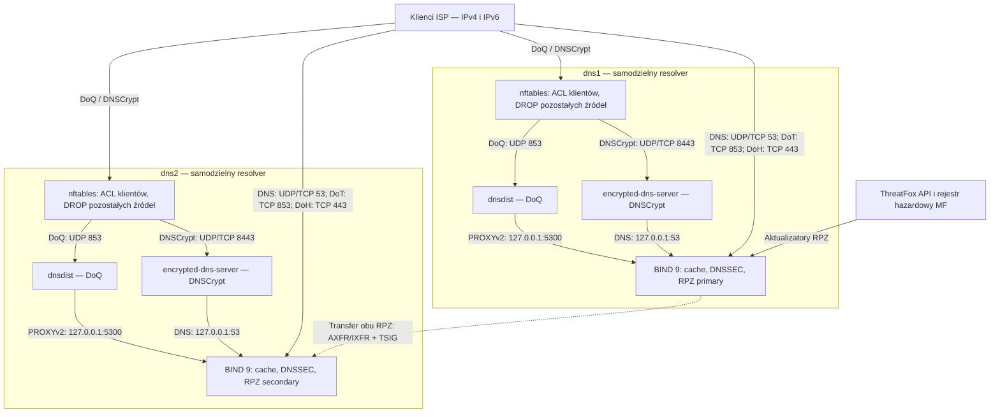

# BIND 9 cache resolver dla ISP

**Status: DNS, DoT, DoH, DoQ i DNSCrypt dostępne dla sieci klientów na dns1 i dns2.**
Zakres podstawowy odebrano 7 września 2026; DoQ i DNSCrypt dodano 13 września.

DoQ obsługuje dnsdist na obu serwerach — wyniki odbioru
[dns1](docs/DOQ-DNS1-DEPLOYMENT.md) i [dns2](docs/DOQ-DNS2-DEPLOYMENT.md).
DNSCrypt obsługuje osobny `encrypted-dns-server` na każdym hoście:
[dns2: testy i opóźnienia](docs/DNSCRYPT-DNS2-TEST.md),
[dns1: wdrożenie i odbiór](docs/DNSCRYPT-DNS1-DEPLOYMENT.md).
DNSCrypt w samym dnsdist pozostaje wyłączony z powodu błędu pobierania
certyfikatu TCP; opis tego wariantu znajduje się w
[`docs/DOQ-DNSCRYPT.md`](docs/DOQ-DNSCRYPT.md).

**Instalacja DNSCrypt i aktualizacja konfiguracji:**
[`docs/DNSCRYPT-INSTALL.md`](docs/DNSCRYPT-INSTALL.md), moduł
`installer/bootstrap-dnscrypt.py` (generowanie, kontrola hosta, nowa instalacja).

**Instalacja działającego DoQ:** [`docs/DOQ-INSTALL.md`](docs/DOQ-INSTALL.md).
Zawiera szablon nftables odrzucający UDP 853 spoza ACL od pierwszego pakietu,
jednostki systemd, porty Fail2Ban, odnowienia TLS, testy i wycofanie.

Konfiguracja referencyjna dla pary BIND 9 na Debianie: rekurencyjny resolver/cache,
DNS-over-TLS, DNS-over-HTTPS, DNS-over-QUIC, DNSCrypt, ograniczenie otwartego resolvera, Fail2Ban oraz
ThreatFox RPZ w trybie audytu i rejestr hazardowy MF w aktywnej strefie RPZ.

Obsługa rejestru hazardowego jest nową implementacją funkcji używanego wcześniej
skryptu `hazardBind v0.7 [2022-02-18]`, którego nagłówek wskazuje
[www.kazuko.pl](https://www.kazuko.pl/). Powody migracji oraz wpływ na wydajność
i bezpieczeństwo opisuje dokument `docs/HAZARD-RPZ-MIGRATION.md`.
Publiczny adres przekierowania rejestru hazardowego to `145.237.235.240`.

## Architektura

Klienci mogą korzystać z każdego resolvera niezależnie. Połączenie dns1 → dns2
na schemacie oznacza synchronizację RPZ, nie przekazywanie zapytań klientów.
Oba BIND-y korzystają z dotychczasowych forwarderów.

ThreatFox działa w trybie audytu, a RPZ hazardowa aktywnie zmienia odpowiedzi.
DoQ zachowuje adres klienta w BIND dzięki PROXYv2. W przypadku DNSCrypt
BIND widzi `127.0.0.1`; kontrolę źródeł zapewnia firewall przed frontendem.
Fail2Ban obejmuje na obu hostach UDP `53,853,8443` i TCP `53,443,853,8443`.
Ograniczenia cache, limitów i audytu DNSCrypt opisuje
[`DNSCRYPT-INSTALL.md`](docs/DNSCRYPT-INSTALL.md).

`dns1` jest jedyną maszyną z kluczem ThreatFox i jedyną pobierającą oba źródła.
`dns2` odbiera obie strefy RPZ po zabezpieczonym transferze TSIG. Stary model
dziesiątek tysięcy stref hazardowych został usunięty z aktywnej konfiguracji.

## Dokumentacja

Punktem wejścia jest [`docs/README.md`](docs/README.md). Zawiera uporządkowaną
nawigację dla instalacji, eksploatacji, diagnostyki, kompatybilności i
rollbacku. Końcowy stan produkcji oraz kryteria ponownego otwarcia opisuje
[`docs/PROJECT-STATUS.md`](docs/PROJECT-STATUS.md).

## Zawartość repozytorium

- `bind/` — szablony konfiguracji BIND;
- `dnsdist/` — frontend DoQ z backendem BIND przez PROXYv2; DNSCrypt w tym szablonie wyłączony;
- `encrypted-dns/` — szablon wdrożonego frontendu DNSCrypt do lokalnego BIND;
- `nftables/` — szablon ACL klientów dla DoQ, DROP bez logowania pakietów;
- `fail2ban/` — nadpisanie portów istniejących jaili DNS, w tym UDP 853;
- `servers/` — snapshoty faktycznych konfiguracji dns1 i dns2, z zachowaniem
  ścieżek systemowych i bez sekretów;
- `scripts/` — aktualizacja ThreatFox i rejestru hazardowego RPZ;
- `systemd/` — jednostki frontendów, firewalli i cyklicznych aktualizacji;
- `installer/bootstrap-rpz.sh` — przygotowanie obu RPZ dla roli primary lub
  secondary;
- `installer/bootstrap-dnscrypt.py` — generowanie, kontrola i instalacja osobnego DNSCrypt;
- `docs/` — wdrożenie i testy.

Pierwsze wdrożenie zaczynaj od dokumentu wskazanego w indeksie jako „Czysty
Debian 13”. Nie kopiuj bezpośrednio snapshotów `servers/` na inny system.

Nigdy nie commituj API key, TSIG secret, certyfikatów TLS ani pobranego feedu RPZ.
